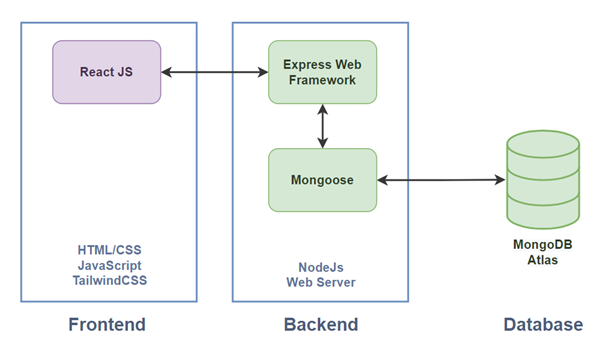
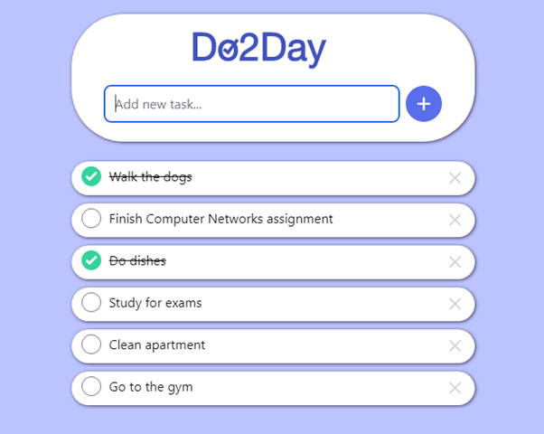
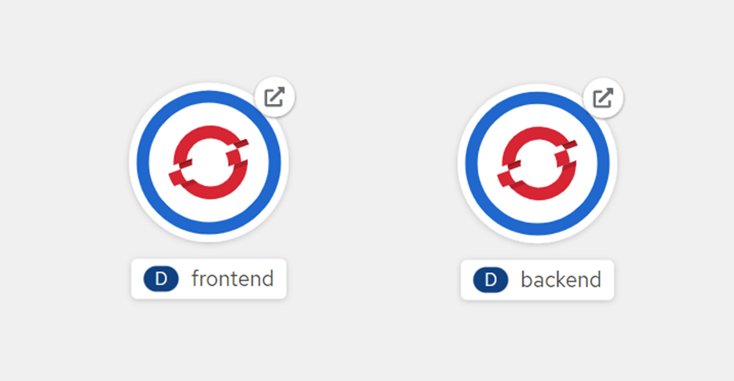
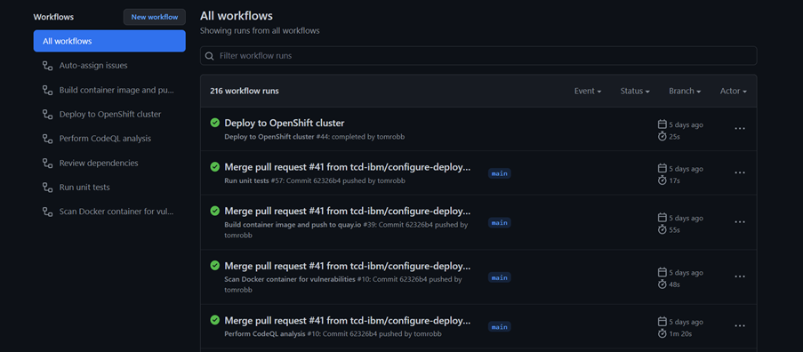
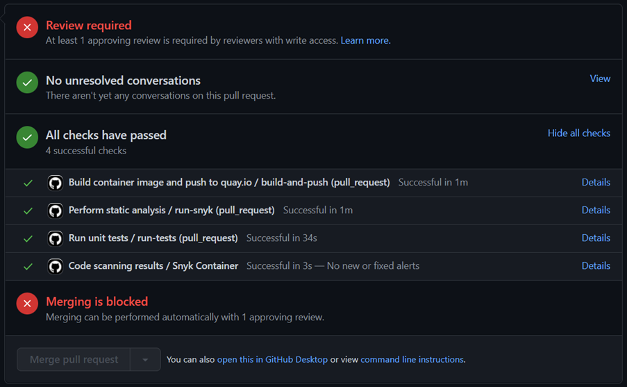

# Do2Day
## Overview
Our project was to build a TODO application and so we came up with Do2Day, a TODO app with a React frontend, node.js backend and a MongoDB database to store the TODOs persistently. In truth though, anybody could probably create something similar with a few Youtube tutorials. The main focus of our project wasn’t in the application itself but in the crafting of it. Our mentors, Mihai and Panpan at IBM showed us how important laying the foundations is in order to build substantial pieces of software.

We tried as much as possible to get to grips with practices found in modern day software engineering teams, and we made lots of mistakes along the way, but ultimately we really got a feel for what it takes to be a great software engineer as opposed to a good programmer.

From using a microservice architecture, making comprehensive sprint plans and documenting our architectural decisions, to setting up code reviews, building, testing and deploying our application and performing static analysis on the codebase, our project has been a great learning experience for us all and has really given us a good foundation for future software engineering projects.

## The Architecture
Originally, we had began with a monlithic architecture for our application in which we used a single repository for encorporating the frontend, backend and database. After some feedback from our mentors, Mihai and Panpan, we opted to change this approach to a microservice architecture in which we separated the frontend and backend completely into separate repositories, and instead made them interact via an API.

## The Application
The application consists of a simple React frontend, which is unit tested using Jest, a simple node.js backend, which is unit tested using Mocha and a MongoDB database. All of these components are completely distinct and interact via well-defined APIs.

## The CI/CD Pipeline
We built both the frontend and backend into container images, unit tested theme using Jest and Mocha respectively, pushed the container images to a container registry (Quay.io), deployed these container images to a Kubernetes cluster on OpenShift, and performed a variety of static analysis against the codebase.

It's fair to say, this is where the bulk of project was focused, and using GitHub Actions made this quite straightforward, enabling us to use custom actions and write our own workflows to suit our needs. We could define our workflow triggers on pull requests, pushes and a variety of other triggers and enabled the entire process to be sped up once properly configures.

